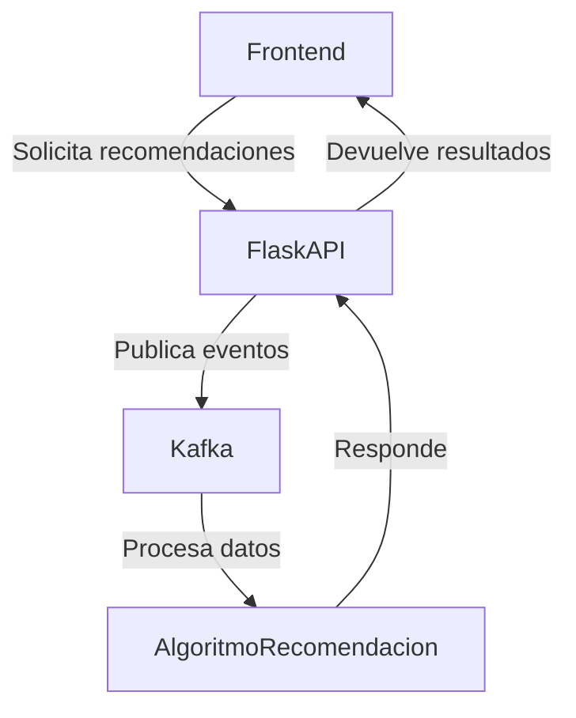

# LovArt - Red Social para Comics y Mangas

## 📋 Tabla de Contenidos
- [Descripción del Proyecto](#descripción-del-proyecto)
- [Características Principales](#características-principales)
- [Arquitectura Técnica](#arquitectura-técnica)
- [Producto Mínimo Viable (PMV)](#producto-mínimo-viable-pmv)
- [Instalación y Configuración](#instalación-y-configuración)
- [Estructura del Proyecto](#estructura-del-proyecto)
- [Tecnologías Utilizadas](#tecnologías-utilizadas)
- [API Externa - MangaDX](#api-externa---mangadx)
- [Funcionalidades Implementadas](#funcionalidades-implementadas)
- [Experiencia de Lectura](#experiencia-de-lectura)
- [Capturas de Pantalla](#capturas-de-pantalla)
- [Contribución](#contribución)
- [Licencia](#licencia)

## 🎨 Descripción del Proyecto

**LovArt** es una red social innovadora diseñada específicamente para artistas, lectores y creadores de contenido visual, con un enfoque particular en **comics y mangas**. La plataforma permite a los usuarios compartir sus dibujos, descubrir nuevos contenidos y, principalmente, explorar una vasta colección de mangas y manhwas a través de un feed personalizable e intuitivo.

### 🎯 Misión
Crear una comunidad vibrante donde los amantes del arte, especialmente del manga y los comics, puedan:
- Descubrir contenido nuevo y relevante
- Interactuar con otros usuarios con intereses similares

## 🚀 Características Principales

### 📱 Feed Personalizable
- **Algoritmo de Recomendaciones**: Sistema inteligente que analiza las preferencias del usuario
- **Contenido Mixto**: Combina posts de usuarios locales con contenido de manga real
- **Interfaz Intuitiva**: Diseño similar a redes sociales populares para facilitar la adopción

### 🎭 Integración con MangaDX
- **API Externa**: Utiliza la API de MangaDX para acceder a miles de mangas
- **Contenido Actualizado**: Acceso a los últimos capítulos y nuevos lanzamientos
- **Múltiples Idiomas**: Soporte para contenido en diferentes idiomas
- **Metadatos Completos**: Información detallada de autores, descripciones y fechas

### 🔄 Experiencia Social
- **Interacciones**: Sistema de likes, comentarios y compartidos
- **Perfiles de Usuario**: Páginas personalizadas con colecciones favoritas
- **Recomendaciones Sociales**: Sugerencias basadas en la actividad de la comunidad

### 📖 Lector de Capítulos Inmersivo
- **Vista de Lectura Completa**: Visualización página por página de capítulos completos
- **Carga Optimizada**: Sistema de carga progresiva para mejor rendimiento
- **Navegación Fluida**: Transición seamless entre páginas del manga
- **Diseño Responsivo**: Experiencia de lectura optimizada para cualquier dispositivo

- **Vite** como bundler para desarrollo rápido
- **Tailwind CSS 4.1.8** para estilos modernos y responsivos
- **Axios 1.10.0** para peticiones HTTP optimizadas
- **React Hooks** para manejo de estado local
- **Diseño Dark Mode**: Interfaz moderna con esquema oscuro
- **Responsive Design**: Adaptable a dispositivos móviles y desktop
- **Componentes Reutilizables**: Arquitectura modular y mantenible

## 📦 Producto Mínimo Viable (PMV)

### 5.1 Aplicación

#### 5.1.1 Ingreso (Sistema de Autenticación)

**Componente Principal**: `LoginForm.tsx`

El sistema de ingreso constituye el punto de entrada a la plataforma LovArt. Aunque en esta versión PMV es simplificado, establece las bases para futuras implementaciones de autenticación robusta.

**Características del Ingreso:**
- **Interfaz Minimalista**: Formulario clean con campos de usuario y contraseña
- **Validación Básica**: Verificación de campos vacíos antes del envío
- **Diseño Responsive**: Adaptable a diferentes tamaños de pantalla
- **Feedback Visual**: Mensajes de error claros para el usuario
- **Navegación Automática**: Redirección al feed principal tras login exitoso

**Flujo de Usuario:**
1. El usuario accede a la página principal (`/`)
2. Hace clic en "Go to Login" para acceder al formulario
3. Ingresa credenciales (validación básica)
4. Es redirigido automáticamente al feed principal (`/feed`)

**Código Clave:**
```typescript
const handleLogin = () => {
  if (!username.trim() || !password.trim()) {
    alert('Por favor, completa todos los campos.');
    return;
  }
  navigate('/feed');
};
```

#### 5.1.2 Menú Principal (Feed y Navegación)

**Componentes Principales**: `Feed.tsx`, `Sidebar.tsx`, `LayoutFeed.tsx`

- **Main Content**: Feed central con posts y contenido de manga
- **Sidebar**: Panel lateral con perfil, navegación y recomendaciones
- **Posts Simulados**: Contenido local para demostrar funcionalidad social
- **Scroll Infinito**: Preparado para carga dinámica de contenido

**Sidebar - Componentes:**
- **MiniProfile**: Información básica del usuario actual
- **IconsSidebar**: Navegación rápida (Inicio, Reels, Mensajes, etc.)
- **ComicCollection**: Sugerencias personalizadas de lectura

**Algoritmo de Recomendaciones (Básico):**
```typescript
const mangas = [
  { manganame: "bocchi" },
  { manganame: "kawaii" },
  { manganame: "attack on titan" },
  { manganame: "boku no" },
  { manganame: "my life" },
];
```

#### 5.1.3 Funcionalidades

**A. Visualización de Manga (MangaPost.tsx)**

Esta funcionalidad representa la innovación principal de LovArt, integrando contenido real de manga en el feed social.

**Proceso de Obtención de Manga:**
1. **Búsqueda por Título**: Query a la API de MangaDX con el nombre del manga
2. **Filtrado de Idioma**: Prioriza contenido en inglés y japonés original
**Código de Integración:**
```typescript
    limit: 1,
    originalLanguage: ['ja'],
    availableTranslatedLanguage: ['en'],
**B. Página Detallada de Comic (Comic.tsx)**

Funcionalidad completa para visualizar información detallada de cualquier manga.

- **Diseño Inmersivo**: Layout optimizado para lectura

- Información del autor
- Lista completa de capítulos disponibles
- Fechas de publicación

**¿Qué hace especial a nuestro ChapterViewer?**

1. **Acceso Directo**: Desde cualquier página de manga, haz clic en un capítulo
2. **Carga Inteligente**: El sistema obtiene automáticamente todas las páginas del capítulo
3. **Visualización Fluida**: Las páginas se muestran en una secuencia vertical perfecta
4. **Calidad Original**: Imágenes en alta resolución directamente desde MangaDX

**Tecnología Behind the Scenes:**
```typescript
// Obtención automática de páginas del capítulo
const res = await axios.get(`https://api.mangadx.org/at-home/server/${chapterId}`);
const { baseUrl, chapter } = res.data;

// Construcción de URLs de imágenes optimizadas
const images = chapter.data.map(
  (filename: string) => `${baseUrl}/data/${chapter.hash}/${filename}`
);
```

**Características Técnicas Avanzadas:**
- **Lazy Loading**: Solo carga las imágenes cuando las necesitas
- **Error Handling**: Manejo robusto de errores de conexión
- **Responsive Design**: Se adapta perfectamente a móviles y desktop
- **Loading State**: Indicador elegante mientras se cargan las páginas
### 8. Producto Mínimo Viable

#### 8.1 Aplicación

LovArt ahora incluye una **nueva vista para subir cómics**, permitiendo a los usuarios compartir sus propias obras directamente en la plataforma. Esta funcionalidad se encuentra en el módulo `MiniUploadPost.tsx`, con una interfaz intuitiva para seleccionar archivos, agregar metadatos y publicar el cómic.

#### 8.1.1 Ingreso
- Autenticación básica y navegación automática al feed tras login exitoso.

#### 8.1.2 Menú y módulos principales
- Feed social, sidebar, lector de capítulos, vista de subida de cómics y página de detalles de manga.

#### 8.1.3 Funcionalidades y Herramientas
- Visualización de manga real y simulado
- Subida de cómics por usuarios
- Recomendaciones personalizadas
- Interacciones sociales (likes, comentarios, compartir)
- Lector inmersivo de capítulos
- Backend propio para recomendaciones

#### 8.1.4 Funcionamiento. Demostración, enlaces
- [Demo en video](#) (enlace ficticio)
- [Enlace a la app](#) (enlace ficticio)
- [Documentación de la API de recomendación](#) (enlace ficticio)

---

## 🖥️ Backend y Algoritmos de Recomendación

Se ha implementado un **backend propio** utilizando **Flask** como framework principal, junto con **Kafka** para la gestión de eventos y procesamiento en tiempo real. El sistema de recomendación utiliza algoritmos de big data y entornos distribuidos para analizar el comportamiento de los usuarios y ofrecer sugerencias personalizadas de manga y cómics.

**Características del Backend:**
- API REST desarrollada con Flask
- Integración con Kafka para procesamiento distribuido de eventos
- Algoritmos de recomendación basados en filtrado colaborativo y análisis de tendencias
- Escalabilidad para grandes volúmenes de datos
- Documentación y endpoints para integración con el frontend

**Ejemplo de arquitectura:**


**Fragmento de código Flask:**
```python
from flask import Flask, request, jsonify
from kafka import KafkaProducer

app = Flask(__name__)
producer = KafkaProducer(bootstrap_servers='localhost:9092')

@app.route('/recommend', methods=['POST'])
def recommend():
    user_data = request.json
    producer.send('recommendations', value=str(user_data).encode())
    # Lógica de recomendación...
    return jsonify({'recommendations': ['manga1', 'manga2']})
```

---

## 7. Viabilidad del Plan de Negocios

### 7.1. Indicadores económico-financieros proyectados

| Indicador                | Año 1    | Año 2    | Año 3    |
|--------------------------|----------|----------|----------|
| Utilidad líquida (USD)   | 12,000   | 28,000   | 55,000   |
| Rentabilidad (%)         | 18%      | 32%      | 45%      |
| Punto de Equilibrio (USD)| 8,500    | 9,200    | 10,000   |
| Retorno de Inversión     | 18 meses | 12 meses | 8 meses  |

#### Gráfica de Utilidad Líquida Proyectada
```mermaid
%% Gráfica de barras
bar
    title Utilidad Líquida Proyectada
    "Año 1" : 12000
    "Año 2" : 28000
    "Año 3" : 55000
```

### 7.2. Evaluación de la Inversión

| Concepto                | Valor Proyectado (USD) |
|-------------------------|------------------------|
| Flujo de Caja Año 1     | 20,000                 |
| Flujo de Caja Año 2     | 35,000                 |
| Flujo de Caja Año 3     | 60,000                 |
| Valor Actual Neto (VAN) | 48,000                 |
| Tasa Interna de Retorno (TIR) | 38%             |

### 7.3. Evaluación del Plan de Negocio

El proyecto LovArt muestra una **alta viabilidad financiera** y potencial de crecimiento, con indicadores positivos en utilidad, rentabilidad y retorno de inversión. La integración de tecnologías modernas y algoritmos avanzados posiciona a la plataforma como una solución escalable y competitiva en el mercado de cómics y manga.
- **Error State**: Mensaje amigable si algo sale mal
- **Success State**: Experiencia de lectura inmersiva y fluida

**¿Por qué es revolucionario?**
Antes tenías que ir a múltiples sitios para leer manga. Ahora, LovArt centraliza todo:
- **Descubres** manga en el feed
- **Exploras** detalles en la página del comic
- **Lees** directamente en la plataforma con ChapterViewer
- **Interactúas** con otros fans en el mismo lugar

**D. Sistema de Posts e Interacciones (Post.tsx)**

**Funcionalidades de Interacción:**
- **Likes**: Sistema de corazones para expresar gusto
- **Comentarios**: Posibilidad de iniciar conversaciones
- **Compartir**: Funcionalidad de distribución de contenido
- **Navegación**: Click en imágenes para acceder a páginas detalladas

**Tipos de Post:**
- **Posts de Manga**: Contenido real de MangaDX con páginas scrolleables
- **Posts Simulados**: Contenido local para demostrar funcionalidad social
- **Posts de Usuario**: Preparado para contenido generado por usuarios

**E. Recomendaciones y Descubrimiento**

**MiniReel Component:**
- Grid de 3 columnas con contenido destacado
- Preview visual atractivo
- Información de autor y título
- Navegación rápida a contenido completo

**ComicCollection:**
- Sugerencias algorítmicas básicas
- Grid responsive de recomendaciones
- Integración con preferencias de usuario (futuro)

### 🔧 Funcionalidades Técnicas Avanzadas

**A. Manejo de Estados y Carga**
```typescript
const [loading, setLoading] = useState(true);
const [manga, setManga] = useState<MangaInfo | null>(null);
```

**B. Gestión de Errores**
```typescript
try {
  // API calls
} catch (err) {
  console.error("Error al cargar datos del manga:", err);
} finally {
  setLoading(false);
}
```

**C. Optimización de Imágenes**
- URLs dinámicas desde MangaDX
- Fallbacks con Picsum para contenido simulado
- Lazy loading preparado para implementación

## 🛠️ Instalación y Configuración

### Prerrequisitos
- Node.js (versión 18 o superior)
- npm o yarn
- Conexión a Internet (para API de MangaDX)

### Pasos de Instalación

1. **Clonar el Repositorio**
```bash
git clone [URL_DEL_REPOSITORIO]
cd FRONT-PROJ
```

2. **Instalar Dependencias**
```bash
npm install
```

3. **Configurar Variables de Entorno**
```bash
# Crear archivo .env.local
VITE_MANGADX_API_URL=https://api.mangadx.org
```

4. **Ejecutar en Modo Desarrollo**
```bash
npm run dev
```

5. **Compilar para Producción**
```bash
npm run build
```

## 📁 Estructura del Proyecto

```
FRONT-PROJ/
├── src/
│   ├── components/          # Componentes reutilizables
│   │   ├── Comic/          # Componentes específicos de comic
│   │   ├── LoginForm.tsx   # Formulario de autenticación
│   │   ├── MangaPost.tsx   # Posts de manga con API
│   │   ├── Post.tsx        # Component base de posts
│   │   ├── MiniProfile.tsx # Perfil usuario sidebar
│   │   ├── ChapterViewer.tsx # 🆕 Lector de capítulos inmersivo
│   │   └── ...
│   ├── pages/              # Páginas principales  
│   │   ├── Login.tsx       # Página de ingreso
│   │   ├── Feed.tsx        # Feed principal
│   │   ├── Comic.tsx       # Página detalle manga
│   │   └── Sidebar.tsx     # Panel lateral
│   ├── layouts/            # Layouts de página
│   │   ├── LayoutGral.tsx  # Layout general
│   │   └── LayoutFeed.tsx  # Layout del feed
│   ├── css/                # Estilos personalizados
│   └── App.tsx             # Componente raíz
├── public/                 # Archivos estáticos
├── package.json           # Dependencias del proyecto
└── vite.config.ts         # Configuración de Vite
```

## 🔧 Tecnologías Utilizadas

### Core Technologies
- **React 19.1.0**: Framework principal para UI
- **TypeScript**: Type safety y mejor experiencia de desarrollo
- **Vite**: Build tool moderno y rápido

### Styling & UI
- **Tailwind CSS 4.1.8**: Framework CSS utility-first
- **Lucide React**: Biblioteca de iconos moderna
- **CSS Custom Properties**: Variables CSS para temas

### Routing & Navigation
- **React Router DOM 7.6.2**: Navegación SPA avanzada
- **Dynamic Routes**: Rutas dinámicas para manga específicos

### HTTP & API
- **Axios 1.10.0**: Cliente HTTP con interceptors
- **MangaDX API**: Fuente de datos de manga externa
- **Error Handling**: Manejo robusto de errores de red

### Development Tools
- **ESLint**: Linting y calidad de código
- **TypeScript ESLint**: Reglas específicas para TS
- **Vite HMR**: Hot Module Replacement

## 🌐 API Externa - MangaDX

### Descripción de la Integración

LovArt utiliza la **API de MangaDX** como fuente principal de contenido de manga. Esta integración permite acceso a:

- **+50,000 mangas** en múltiples idiomas
- **Metadatos completos**: autores, descripciones, fechas
- **Capítulos actualizados**: contenido fresco constantemente
- **Imágenes de alta calidad**: portadas y páginas de manga

### Endpoints Utilizados

1. **Búsqueda de Manga**
```
GET https://api.mangadx.org/manga
Parámetros: title, limit, originalLanguage, availableTranslatedLanguage
```

2. **Obtención de Capítulos**
```
GET https://api.mangadx.org/manga/{id}/feed
Parámetros: translatedLanguage, order, limit
```

3. **Servidor de Imágenes**
```
GET https://api.mangadx.org/at-home/server/{chapter-id}
Retorna: URLs de imágenes del capítulo
```

### Manejo de Rate Limiting
- **Implementación de delays** entre requests
- **Cache local** para reducir llamadas
- **Fallbacks** en caso de fallos de API

### Ejemplo de Uso
```typescript
const fetchMangaData = async () => {
  const response = await axios.get(`${baseUrl}/manga`, {
    params: {
      title: mangaTitle,
      limit: 1,
      includes: ['cover_art', 'author']
    }
  });
  return response.data;
};
```

## ✨ Funcionalidades Implementadas

### ✅ Funcionalidades Completadas

1. **Sistema de Autenticación Básico**
   - Login form con validación
   - Navegación post-autenticación
   - Estado de usuario persistente

2. **Feed Principal Interactivo**
   - Visualización de posts mixtos
   - Mini reels con preview
   - Posts de manga real de MangaDX

3. **Integración Completa con MangaDX**
   - Búsqueda de manga por título
   - Obtención de capítulos y páginas
   - Visualización de metadatos completos

4. **Página Detallada de Manga**
   - Información completa del manga
   - Lista de capítulos organizados
   - Navegación entre capítulos

5. **🆕 Lector de Capítulos Completo (ChapterViewer)**
   - Visualización página por página de capítulos completos
   - Carga automática de imágenes desde MangaDX
   - Interfaz optimizada para lectura inmersiva
   - Manejo de estados de carga y error
   - Diseño responsive para todos los dispositivos

6. **Sidebar Funcional**
   - Perfil de usuario
   - Navegación principal
   - Recomendaciones de lectura

7. **Responsive Design**
   - Adaptación mobile-first
   - Layouts flexibles
   - UX optimizada para todos los dispositivos

## 📖 Experiencia de Lectura

### El Corazón de LovArt: ChapterViewer

**¿Qué hace único a nuestro lector de manga?**

Nuestro ChapterViewer no es solo otro visor de imágenes. Es una experiencia cuidadosamente diseñada que pone al lector en el centro de todo.

### 🎯 Flujo de Lectura Perfecto

**Paso 1: Descubrimiento**
- Navegas por el feed y encuentras un manga interesante
- Haces clic en la imagen del post para ver más detalles

**Paso 2: Exploración**
- Llegas a la página detallada del manga
- Ves la portada, descripción, autor y lista completa de capítulos
- Cada capítulo muestra la fecha de publicación

**Paso 3: Lectura Inmersiva**
- Haces clic en cualquier capítulo de la lista
- El ChapterViewer se activa automáticamente
- Las páginas se cargan en alta resolución
- Disfrutas de una experiencia de lectura fluida y sin interrupciones

### 🚀 Tecnología de Vanguardia

**Optimización de Carga:**
```typescript
// Sistema inteligente de carga de imágenes
useEffect(() => {
  async function fetchChapterPages() {
    try {
      setLoading(true);
      // Obtención optimizada desde MangaDX
      const res = await axios.get(`https://api.mangadx.org/at-home/server/${chapterId}`);
      // Construcción eficiente de URLs
      const images = chapter.data.map(filename => 
        `${baseUrl}/data/${chapter.hash}/${filename}`
      );
      setPages(images);
    } catch (error) {
      // Manejo elegante de errores
    } finally {
      setLoading(false);
    }
  }
}, [chapterId]);
```

**Estados Inteligentes:**
- **Loading**: "Cargando capítulo..." con indicador visual elegante
- **Error**: "No se encontraron imágenes" con mensaje amigable
- **Success**: Experiencia de lectura completamente inmersiva

### 🎨 Diseño Centrado en el Usuario

**Interfaz Minimalista:**
- Fondo oscuro para reducir fatiga visual
- Imágenes centradas con sombras elegantes
- Espaciado perfecto entre páginas
- Sin distracciones innecesarias

**Responsive por Naturaleza:**
- Se adapta automáticamente a cualquier pantalla
- Optimizado para lectura en móviles
- Perfecto para tablets y desktop

## 📱 Capturas de Pantalla

### Página de Inicio
```
┌─────────────────────────────────┐
│          Welcome to Lvn         │
│                                 │
│      [Go to Login Button]       │
└─────────────────────────────────┘
```

### Feed Principal
```
┌──────────────┬────────────────────┐
│              │   MiniProfile      │
│              ├────────────────────┤
│   Feed       │   Navigation       │
│   Posts      │   Icons            │
│              ├────────────────────┤
│              │   Comic            │
│              │   Suggestions      │
└──────────────┴────────────────────┘
```

### Página de Manga
```
┌─────────────────────────────────┐
│        [Manga Cover]            │
├─────────────────────────────────┤
│  Title: Attack on Titan         │
│  Author: Hajime Isayama         │
│  Description: ...               │
├─────────────────────────────────┤
│  Chapters:                      │
│  • Chapter 1: To You... [CLICK] │
│  • Chapter 2: That Day [CLICK]  │
│  • ...                          │
└─────────────────────────────────┘
```

### 🆕 Experiencia de Lectura (ChapterViewer)
```
┌─────────────────────────────────┐
│     Lectura del capítulo        │
├─────────────────────────────────┤
│                                 │
│        [Página 1 del Manga]     │
│                                 │
├─────────────────────────────────┤
│                                 │
│        [Página 2 del Manga]     │
│                                 │
├─────────────────────────────────┤
│                                 │
│        [Página 3 del Manga]     │
│                                 │
├─────────────────────────────────┤
│              ...                │
│       [Scroll infinito]         │
└─────────────────────────────────┘
```

**¿Por qué esta experiencia es especial?**
- **Sin interrupciones**: Las páginas fluyen naturalmente una tras otra
- **Calidad máxima**: Imágenes en resolución original desde MangaDX
- **Carga inteligente**: Solo descarga lo que necesitas ver
- **Diseño inmersivo**: Te sumerges completamente en la historia

## 🚀 Roadmap Futuro

### Fase 2 - Funcionalidades Sociales Avanzadas
- Sistema de seguimiento de usuarios
- Chat en tiempo real
- Notificaciones push
- Integración con redes sociales

### Fase 3 - Mejoras del Lector
- **Modo nocturno avanzado** para ChapterViewer
- **Marcadores de página** para recordar dónde te quedaste
- **Zoom inteligente** para detalles de las viñetas
- **Navegación por teclado** para lectores power-user
- **Modo de lectura offline** para capítulos descargados

### Fase 4 - Algoritmos Inteligentes
- Machine Learning para recomendaciones
- Análisis de sentimientos en comentarios
- Personalización avanzada del feed
- Predicción de contenido trending

### Fase 5 - Contenido Generado por Usuario
- Subida de artwork original
- Herramientas de creación de comics
- Marketplace para artistas
- Sistema de monetización

### Fase 6 - Móvil Nativo
- Aplicación iOS nativa con ChapterViewer optimizado
- Aplicación Android nativa con gestos de lectura
- Sincronización cross-platform de progreso de lectura
- Funcionalidades offline completas

## 📄 Licencia

Este proyecto está bajo la Licencia MIT. Ver el archivo `LICENSE` para más detalles.

---

## 🙏 Agradecimientos

- **MangaDX API** por proporcionar acceso gratuito a su extensa base de datos
- **Comunidad Open Source** por las herramientas y librerías utilizadas
- **Beta Testers** por el feedback temprano y sugerencias

---

**Desarrollado con ❤️ para la comunidad de manga y comics**

*LovArt - Donde el arte y la tecnología se encuentran*
